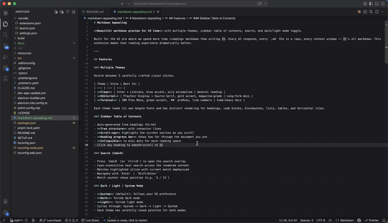

# Markdown Appealing

**Beautiful markdown preview for VS Code** with multiple themes, sidebar table of contents, search, and dark/light mode toggle.

[](vscode:extension/rayeddev.markdown-appealing)  [](cursor:extension/rayeddev.markdown-appealing)

Built for the AI era where we spend more time *reading* markdown than writing it. Every AI response, every `.md` file in a repo, every context window -- it's all markdown. This extension makes that reading experience dramatically better.



---

## Features

### Multiple Themes

Switch between 3 carefully crafted visual styles:

| Theme | Style | Best for |
| --- | --- | --- |
| **Clean** | Inter + Literata, blue accent, airy minimalism | General reading |
| **Editorial** | Playfair Display + Source Serif, gold accent, magazine-grade | Long-form docs |
| **Terminal** | IBM Plex Mono, green accent, `##` prefixes, line numbers | Code-heavy docs |

Each theme loads its own Google Fonts and has distinct rendering for headings, code blocks, blockquotes, lists, tables, and horizontal rules.

### Mermaid Diagrams

Fenced code blocks with language `mermaid` render as visual SVG diagrams inside styled card containers. Supports all Mermaid diagram types — flowcharts, sequence diagrams, state diagrams, ER diagrams, pie charts, and more.

- **Themed card container** with per-theme styling (rounded, accent-bordered, or dashed)
- **Light inner background** ensures diagrams render correctly in both dark and light modes
- **Error handling** — invalid syntax shows a clean "Diagram syntax error" message instead of breaking the preview

### GitHub Alerts

Blockquote-style alerts from the GitHub flavor spec render inline with type-specific icon and label:

```md
> [!NOTE]      Useful information
> [!TIP]       Helpful advice
> [!IMPORTANT] Key information
> [!WARNING]   Urgent caveat
> [!CAUTION]   Negative consequences
```

- **5 GFM alert types** with inline Octicon SVGs (offline — no icon CDN)
- **Per-theme voice** — soft card in clean, magazine rule in editorial, dashed `[!TYPE]` box in terminal
- **Body supports inline markdown** — links, emphasis, code, multi-paragraph

### YAML Frontmatter Card

Files with YAML frontmatter (`---` delimited key:value blocks) render as a styled metadata card at the top of the preview instead of broken `<hr>` elements. Two-column key-value layout with row separators, automatic quote stripping, and per-theme styling.

### Keyboard Navigation

Vim-style heading navigation without leaving the preview:

| Key | Action |
| --- | --- |
| `j` / `k` | Next / previous heading |
| `gg` / `G` | First / last heading |
| `[` / `]` | Previous / next sibling (same level) |
| `/` | Open search |

Active heading is highlighted with a cursor bar that persists across re-renders and syncs bidirectionally with the TOC sidebar.

### Sidebar Table of Contents

- Auto-generated from headings (h1-h4)
- **Tree structure** with connector lines
- **Scroll-spy** highlights the current section as you scroll
- **Reading progress bar** shows how far through the document you are
- **Collapsible** to mini dots for more reading space
- Click any heading to smooth-scroll to it

### Search (Cmd+K or /)

- Press `Cmd+K`, `Ctrl+K`, or `/` to open the search overlay
- Case-insensitive text search across the rendered content
- Matches highlighted inline with current match emphasized
- Navigate with `Enter` / `Shift+Enter`
- Match counter shows position (e.g. `3 / 12`)

### Inline Metadata Grid

Runs of `**Label:** value` lines render as a compact two-column grid — the same visual family as the YAML frontmatter card, with tighter padding so it sits naturally mid-document.

- Triggers on **2 or more** consecutive matching lines (singletons stay as regular paragraphs, so `**Note:** see below.` is unaffected)
- Works in two source forms — multiple lines in one paragraph (softbreak-separated) or multiple paragraphs separated by blank lines
- Values render as inline markdown — links, inline code, emphasis all flow through
- No new syntax to learn — existing `**Label:** value` patterns just look better

### Fullscreen Reading Mode

Toggle a distraction-free view in one click or one command.

- Floating button at the bottom-right of the preview, or `Markdown Appealing: Toggle Fullscreen` in the Command Palette
- Composes VS Code's Zen Mode — hides sidebar, activity bar, status bar, tabs; enters OS fullscreen when your `zenMode.fullScreen` setting is on (default on macOS/Windows)
- Respects your own `zenMode.*` settings instead of overriding them
- Double-`Esc` exits (standard Zen Mode behavior)
- Scroll position, active heading, search state, and theme state all survive entry/exit

### Dark / Light / System Mode

- **System** (default): follows your OS preference
- **Dark**: forced dark mode
- **Light**: forced light mode
- Cycles through: System -> Dark -> Light -> System
- Each theme has carefully tuned palettes for both modes
- Selected theme + mode **persist across sessions** — your pick survives panel close and reopen

### Font Customization

Configure fonts and sizes via VS Code settings:

- Body font, heading font, code font
- Body size, code size
- Preview re-renders live when settings change

### Live Preview

- Updates in real-time as you edit
- Follows your active markdown file
- Opens in the same tab (replaces the editor)

### Code Blocks

- **Syntax highlighting** for ~36 popular languages (JS/TS, Python, Go, Rust, Bash, JSON, CSS, HTML, SQL, and more) via highlight.js
- Light + dark token palettes tuned to read across all three themes
- Language label in header
- **Copy button** with "Copied" feedback
- **Line numbers** (visible in Terminal theme)
- Styled borders and backgrounds per theme

---

## Usage

### Open Preview

1. Open any `.md` file
2. Use one of:
   - **Keyboard**: `Cmd+Shift+V` (Mac) / `Ctrl+Shift+V` (Windows/Linux)
   - **Command Palette**: `Cmd+Shift+P` > `Markdown Appealing: Open Preview`

### Switch Theme

- Click theme buttons in the toolbar (Clean / Editorial / Terminal)
- Or use Command Palette: `Markdown Appealing: Switch Theme`

### Toggle Dark/Light Mode

- Click the toggle switch in the toolbar
- Or use Command Palette: `Markdown Appealing: Toggle Dark/Light Mode`

### Search

- Press `Cmd+K` / `Ctrl+K` while the preview is focused
- Type your query (minimum 2 characters)
- `Enter` to jump to next match
- `Shift+Enter` to jump to previous match
- `Esc` to close

### Collapse Sidebar

- Click the toggle button at the top of the sidebar
- In collapsed mode, mini dots represent top-level headings -- click them to navigate

---

## Keyboard Shortcuts

| Shortcut | Action |
| --- | --- |
| `Cmd+Shift+V` | Open preview |
| `Cmd+K` or `/` | Search in preview |
| `Enter` | Next search match |
| `Shift+Enter` | Previous search match |
| `Esc` | Close search |
| `j` / `k` | Next / previous heading |
| `gg` / `G` | First / last heading |
| `[` / `]` | Previous / next sibling heading |

---

## Theme Showcase

### Clean Theme
> Airy minimalism for distraction-free reading

- Sans-serif headings (Inter), serif body (Literata)
- Blue accent color
- Subtle h1 divider, rounded code blocks
- Hidden line numbers

### Editorial Theme
> Magazine-grade typography for long reads

- Display headings (Playfair Display), serif body (Source Serif 4)
- Gold/amber accent color
- Decorative `"` on blockquotes
- Uppercase "Section" labels on h2
- Gold accent bar above h1
- Ornamental `...` horizontal rules

### Terminal Theme
> Hacker-native. Built for code-heavy docs

- Monospace headings (IBM Plex Mono), sans body (IBM Plex Sans)
- Green accent color
- `#` / `##` / `###` prefixes on headings
- `NOTE` label on blockquotes
- Arrow `->` list markers
- `* * *` horizontal rules
- **Line numbers** on code blocks

---

## Installation

### From Source (Development)

```bash
git clone <repo-url>
cd markdown-appealing
npm install
npm run compile
```

Then press `F5` in VS Code to launch the Extension Development Host.

### From VSIX

```bash
npm run vscode:prepublish
npx vsce package
code --install-extension markdown-appealing-0.5.0.vsix
```

---

## Requirements

- VS Code 1.85.0 or later

---

## License

MIT
