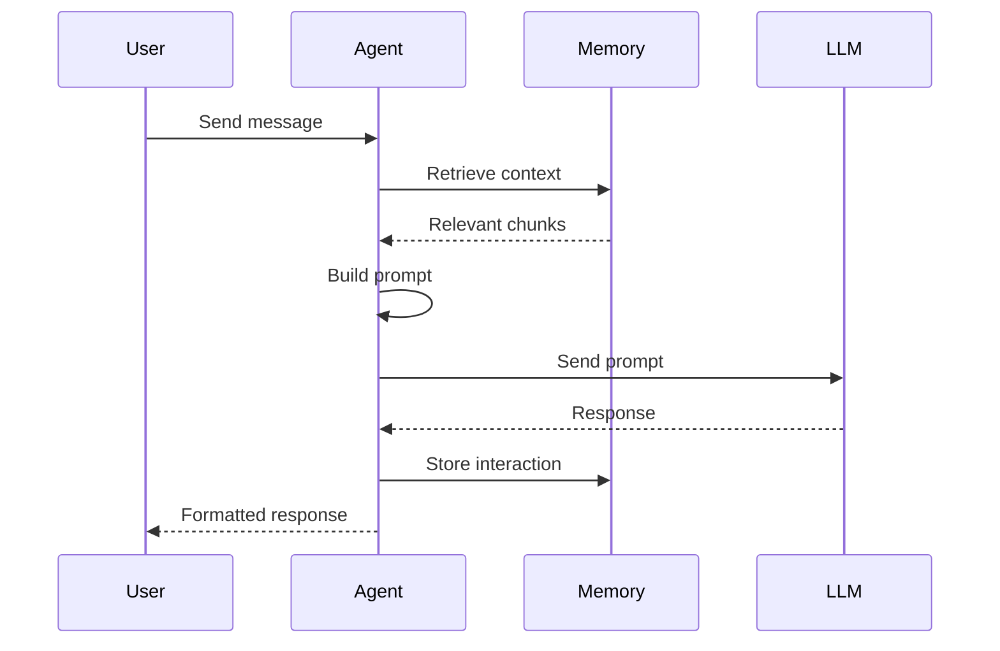
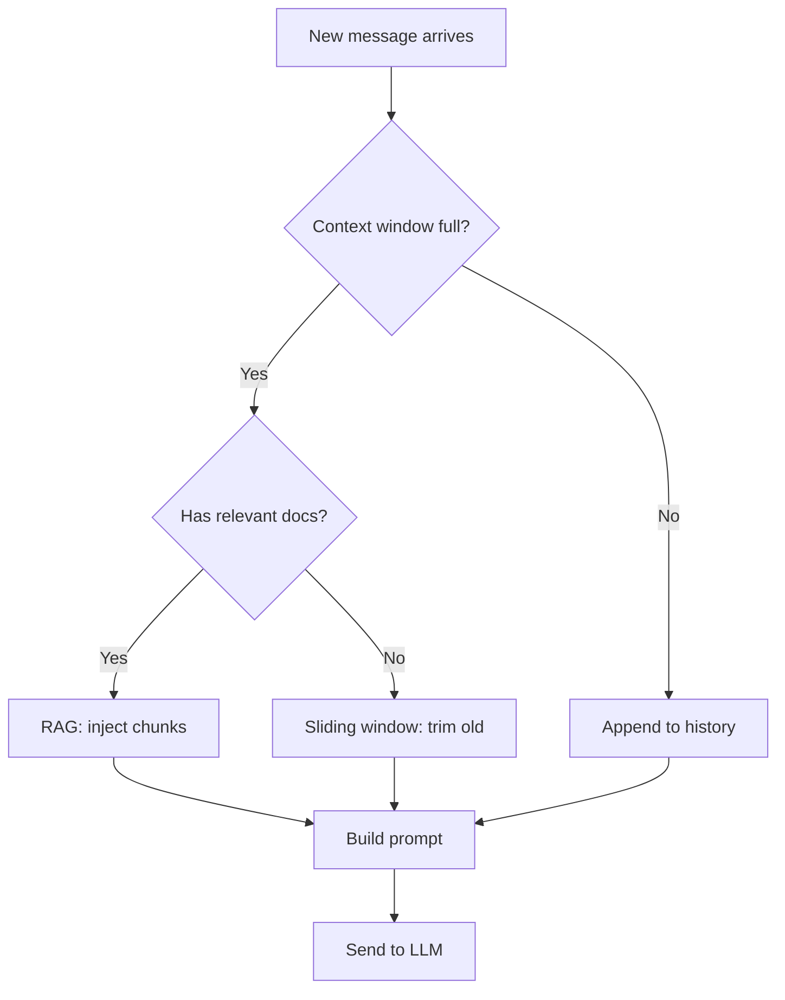
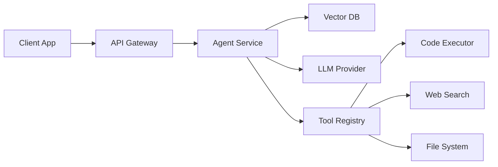
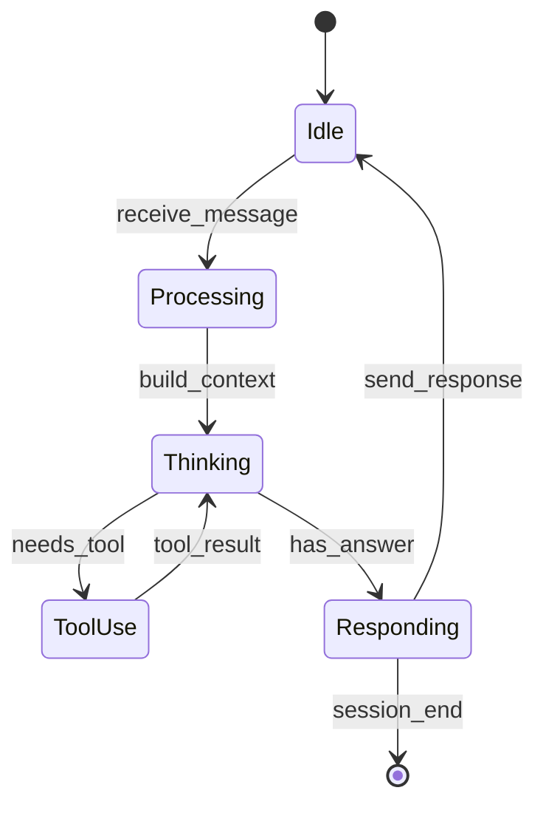
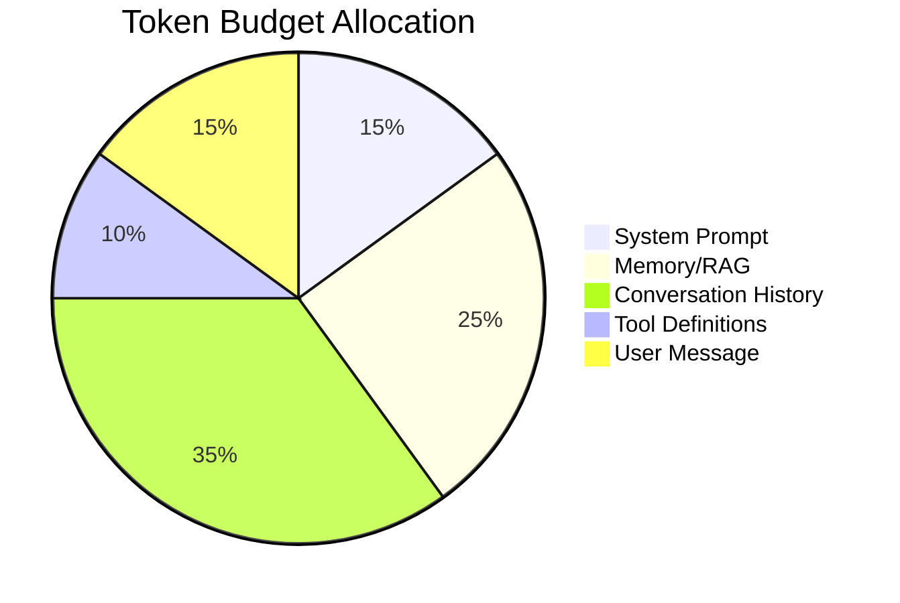

# Building Context-Aware AI Agents

Modern AI agents rely on **structured context** to maintain coherence across long interactions. This guide covers the architecture patterns that actually work in production.

## Why Markdown Is the AI Lingua Franca

Every major LLM speaks Markdown natively. It's become the **universal serialization format** for AI context — not because it's perfect, but because it's *readable by both humans and machines*.

> The best context format is one your team can read in a PR diff and your agent can parse in a system prompt. That format is Markdown.

## Core Architecture

The context stack for a typical AI agent looks like this:

```typescript
interface AgentContext {
  system: string;        // Persona + rules
  memory: MemoryBlock[]; // Retrieved context
  tools: ToolDef[];      // Available actions
  history: Message[];    // Conversation so far
}

function buildPrompt(ctx: AgentContext): string {
  return [
    ctx.system,
    formatMemory(ctx.memory),
    formatTools(ctx.tools),
    ...ctx.history.map(formatMessage),
  ].join("\n\n");
}
```

The key insight: every piece of context is just a `string` that gets concatenated. Markdown headings create natural **attention boundaries** that help the model organize information.

### Callouts & Alerts

GitHub-flavored alerts render inline, each with its own voice per theme.

> [!NOTE]
> Context windows are measured in tokens, not characters. A `gpt-4o` window of 128K tokens is roughly 96K words of English prose.

> [!TIP]
> Cache your system prompt with prompt caching APIs — you'll cut latency by **40-70%** on repeated calls with a stable preamble.

> [!IMPORTANT]
> Always strip PII before injecting retrieved chunks into the prompt. Vector stores are *not* compliance boundaries by default.

> [!WARNING]
> Streaming responses and tool-calling don't always compose cleanly. Some providers require you to disable streaming when tool results come back mid-turn.
>
> Plan for both paths and feature-detect at runtime.

> [!CAUTION]
> Never round-trip secrets through the LLM, even inside tool arguments. Anything the model sees can surface in logs, telemetry, or the next completion.

### Agent Request Flow



## Context Management Patterns

- **Sliding window** — keep the last N messages, summarize the rest
- **RAG injection** — retrieve relevant chunks and insert before the query
- **Hierarchical context** — system > project > task > conversation
- **Compression** — periodically ask the model to summarize its own context

### Pattern Decision Tree



## Performance Comparison

| Pattern | Latency | Accuracy | Token Cost |
| --- | --- | --- | --- |
| Full history | High | Best | $$$ |
| Sliding window | Low | Good | $ |
| RAG + summary | Medium | Great | $$ |
| Hierarchical | Medium | Best | $$ |

---

## System Architecture



## The Reading Problem

Here's the thing nobody talks about: **we read more Markdown than we write**. Every AI response, every `.md` file in a repo, every context window — it's all Markdown. And yet we render it with the same basic stylesheet from 2012.

1. Developers scan AI output dozens of times per day
2. Context files in repos are read by every team member
3. Documentation is consumed 10x more than it's authored
4. AI-generated reports and summaries are all Markdown

> If you're spending 40% of your day reading Markdown, a 20% improvement in readability compounds into hours saved per week.

```python
# The math is simple
daily_md_reading_hours = 3.2
readability_improvement = 0.20
hours_saved_per_week = daily_md_reading_hours * readability_improvement * 5
# => 3.2 hours/week. That's almost half a workday.
```

### Agent State Machine



### Implementation Tips

When building your own context pipeline, keep these rules in mind:

- Always **version your context schema** — you'll thank yourself later
- Use `frontmatter` for metadata, not inline markers
- Keep context files under 2000 tokens for optimal retrieval
- Test with `gpt-4` and `claude-3` to ensure format compatibility

---

## Token Budget Breakdown



## Summary

This isn't a nice-to-have. It's a **developer productivity tool**. The combination of structured frontmatter, clear headings, visual diagrams, and well-formatted code blocks makes complex documentation *actually readable*.
